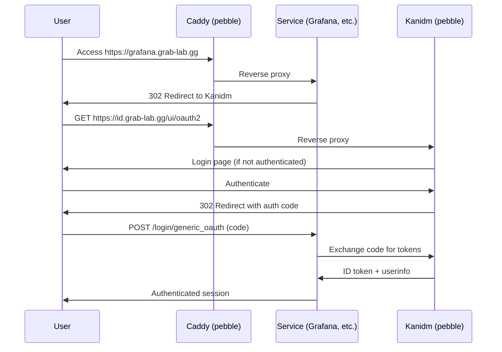

# Authentication Architecture

This homelab uses a **two-tier IdP architecture** to solve the chicken-and-egg problem of VPN authentication.

## Two-Tier Design

```
┌─────────────────────────────────────────────────────────────────┐
│                                                                 │
│  Tier 1: VPS                        Tier 2: Homelab (pebble)   │
│  ┌──────────────────────────┐        ┌──────────────────────┐   │
│  │ Pocket ID                │        │ Kanidm               │   │
│  │ (passkey-only OIDC)      │        │ services.kanidm      │   │
│  │ pocket-id OCI container  │        │ ~50–80 MB RAM        │   │
│  │                          │        │                      │   │
│  │ Handles: NetBird VPN     │        │ Handles: ALL service │   │
│  │ auth ONLY                │        │ SSO (OIDC + LDAP)    │   │
│  │ PKCE + WebAuthn/passkey  │        │ Accessible via VPN   │   │
│  │ ~20 MB RAM               │        │ only (not internet)  │   │
│  └──────────────────────────┘        └──────────────────────┘   │
└─────────────────────────────────────────────────────────────────┘
```

## Why Two Tiers?

**The chicken-and-egg problem:** NetBird VPN auth cannot depend on the homelab IdP, because you need the VPN to reach the homelab — and you need the IdP to authenticate the VPN. A single homelab IdP creates a deadlock.

**The solution:**
- **Tier 1 (VPS):** Pocket ID handles VPN authentication exclusively. It's always reachable (public IP). Passkey/FIDO2 only — no passwords.
- **Tier 2 (homelab):** Kanidm on pebble handles all service SSO. Never exposed to the internet — accessible only via NetBird VPN tunnel.

**Benefits:**
- VPS compromise cannot affect service credentials (Kanidm is on a different machine)
- Reduced attack surface for the critical homelab IdP
- Kanidm embedded SQLite means no PostgreSQL/Redis dependencies

## Per-Service Authentication Table

| Service | Machine | Auth Method | IdP | Notes |
|---------|---------|-------------|-----|-------|
| NetBird VPN | VPS | PKCE + passkey | Pocket ID | `EmbeddedIdP.Enabled = false` |
| Grafana | pebble | Native OIDC | Kanidm | `auth.generic_oauth` settings |
| Vaultwarden | pebble | Native OIDC | Kanidm | Master password still required |
| Homepage | pebble | Caddy forward_auth | Kanidm | oauth2-proxy in front |
| Uptime Kuma | pebble | Caddy forward_auth | Kanidm | oauth2-proxy in front |
| Home Assistant | pebble | Header auth | Kanidm | Via forward_auth |

## Tier 1: Pocket ID (VPS)

Pocket ID is a minimal, passkey-only OIDC provider that replaced embedded Dex in Stage 10b.

**Characteristics:**
- WebAuthn/FIDO2 passkeys only — no email/password auth possible
- Public OIDC client with PKCE (no client secret)
- Serves NetBird dashboard only
- SQLite backend, ~20 MB RAM

**Auth flow:**
1. Browser opens `https://netbird.grab-lab.gg/` → redirects to Pocket ID
2. User authenticates with passkey at `https://pocket-id.grab-lab.gg`
3. Pocket ID redirects back to `/nb-auth` with auth code
4. Dashboard exchanges code (PKCE) for tokens

**Known gotchas:**
- Setup page is `/login/setup` (not `/setup`)
- OIDC client must be **Public** (not confidential)
- `offline_access` scope not supported
- New users require SQLite approval before first login

## Tier 2: Kanidm (pebble)

Kanidm is a modern identity platform with native NixOS module support.

**Key advantage: declarative OAuth2 client provisioning.** All OIDC client registrations happen in NixOS config — co-located with each service module, not centralized.

### Configuration Snippet

```nix
services.kanidm = {
  enableServer = true;
  serverSettings = {
    origin = "https://id.grab-lab.gg";
    bindaddress = "127.0.0.1:8443";
    ldapbindaddress = "127.0.0.1:636";
  };
  provision = {
    enable = true;
    # Users, groups, OAuth2 clients defined here
  };
};
```

### Caddy Virtual Host

```nix
services.caddy.virtualHosts."id.grab-lab.gg" = {
  extraConfig = ''
    reverse_proxy localhost:8443 {
      transport http {
        tls_insecure_skip_verify
      }
    }
  '';
};
```

### Per-Client Issuer URLs

Kanidm uses **per-client issuer URLs**, not a single global issuer. Every service must use the correct per-client discovery endpoint:

```
https://id.grab-lab.gg/oauth2/openid/<client-name>/.well-known/openid-configuration
```

Example for Grafana:
```
https://id.grab-lab.gg/oauth2/openid/grafana/.well-known/openid-configuration
```

This is Kanidm's primary gotcha — configure each service with its specific client name.

## OIDC Flow Diagram (Mermaid)



For services without native OIDC (Homepage, Uptime Kuma), oauth2-proxy sits between Caddy and the service, handling the PKCE flow.

## Known Gotchas

| Gotcha | Detail |
|--------|--------|
| Per-client issuer URLs | Each service gets its own discovery endpoint |
| PKCE S256 enforced | Disable per-client for legacy apps: `kanidm system oauth2 warning-enable-legacy-crypto <client>` |
| ES256 token signing | Kanidm signs with ES256, not RS256. Most modern apps handle this |
| Admin is CLI-only | Web UI is end-user self-service only |
| TLS required internally | Kanidm requires TLS even on localhost. Use `tls_insecure_skip_verify` in Caddy transport |
| Kanidm must run before Outline | Outline has no local auth fallback |

## Deployment Order

```
Stage 4 (Caddy) ──────────────────────────────────────────────────────┐
Stage 7b (NetBird client) ─────────────────────────────────────────────┼──► Stage 7c (Kanidm)
                                                                       │
Stage 7c (Kanidm) ─────────────────────────────────────────────────────┼──► Grafana OIDC
                                                                       │
Stage 7c (Kanidm) ─────────────────────────────────────────────────────┼──► Stage 16 (Outline, Immich, etc.)
```

Kanidm must be deployed and verified before any service requiring SSO.

## Future: Unified Credentials (Optional)

Pocket ID could be replaced by Kanidm as the NetBird OIDC provider, giving unified credentials. However, this reintroduces the chicken-and-egg dependency — you need VPN to reach Kanidm, but need Kanidm to authenticate VPN. A separate NetBird bootstrap user or dedicated admin DNS path would be required.

## Key Files

| File | Purpose |
|------|---------|
| `homelab/kanidm/default.nix` | Kanidm server and OAuth2 client definitions |
| `homelab/grafana/default.nix` | Example native OIDC integration |
| `homelab/homepage/default.nix` | Example oauth2-proxy integration |
| `homelab/caddy/default.nix` | TLS transport and routing |

## See Also

- [overview.md](./overview.md) — System topology and network architecture
- [ports-and-dns.md](./ports-and-dns.md) — Service port assignments
- `docs/IDP-STRATEGY.md` (superseded by this document)