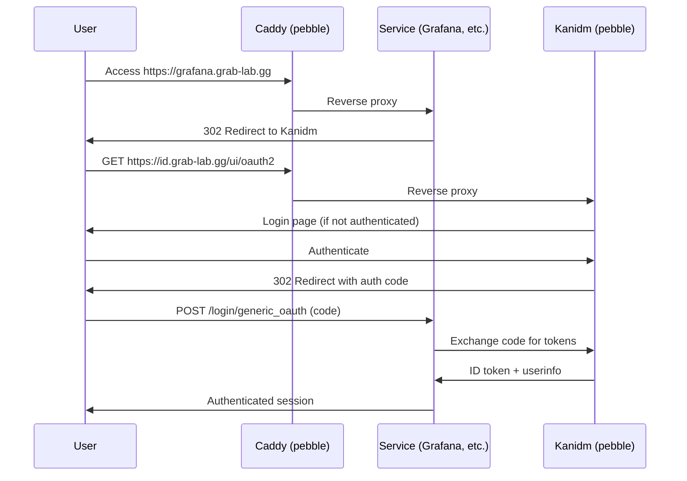

# Authentication Architecture

Kanidm on pebble is the sole IdP for all service SSO. WireGuard VPN access is authenticated by keypairs (no IdP required — see [ADR 0006](./adr/0006-wireguard-over-netbird.md)).

## Per-Service Authentication Table

| Service | Machine | Auth Method | IdP | Notes |
|---------|---------|-------------|-----|-------|
| WireGuard VPN | VPS | Keypair | N/A | Static peers in `homelab/wireguard-server/default.nix` |
| Grafana | pebble | Native OIDC | Kanidm | `auth.generic_oauth` settings |
| Vaultwarden | pebble | Native OIDC | Kanidm | Master password still required |
| Homepage | pebble | Caddy forward_auth | Kanidm | oauth2-proxy in front |
| Uptime Kuma | pebble | Caddy forward_auth | Kanidm | oauth2-proxy in front |
| Home Assistant | pebble | Header auth | Kanidm | Via forward_auth |

## Kanidm (pebble)

Kanidm is a modern identity platform with native NixOS module support.

**Key advantage: declarative OAuth2 client provisioning.** All OIDC client registrations happen in NixOS config — co-located with each service module, not centralized.

### Configuration Snippet

```nix
services.kanidm = {
  enableServer = true;
  serverSettings = {
    origin = "https://id.grab-lab.gg";
    bindaddress = "127.0.0.1:8443";
    ldapbindaddress = "127.0.0.1:636";
  };
  provision = {
    enable = true;
    # Users, groups, OAuth2 clients defined here
  };
};
```

### Caddy Virtual Host

```nix
services.caddy.virtualHosts."id.grab-lab.gg" = {
  extraConfig = ''
    reverse_proxy localhost:8443 {
      transport http {
        tls_insecure_skip_verify
      }
    }
  '';
};
```

### Per-Client Issuer URLs

Kanidm uses **per-client issuer URLs**, not a single global issuer. Every service must use the correct per-client discovery endpoint:

```
https://id.grab-lab.gg/oauth2/openid/<client-name>/.well-known/openid-configuration
```

Example for Grafana:
```
https://id.grab-lab.gg/oauth2/openid/grafana/.well-known/openid-configuration
```

This is Kanidm's primary gotcha — configure each service with its specific client name.

## OIDC Flow Diagram (Mermaid)


```mermaid
sequenceDiagram
    participant User
    participant Caddy as Caddy (pebble)
    participant Service as Service (Grafana, etc.)
    participant Kanidm as Kanidm (pebble)

    User->>Caddy: Access https://grafana.grab-lab.gg
    Caddy->>Service: Reverse proxy
    Service->>User: 302 Redirect to Kanidm
    User->>Caddy: GET https://id.grab-lab.gg/ui/oauth2
    Caddy->>Kanidm: Reverse proxy
    Kanidm->>User: Login page (if not authenticated)
    User->>Kanidm: Authenticate
    Kanidm->>User: 302 Redirect with auth code
    User->>Service: POST /login/generic_oauth (code)
    Service->>Kanidm: Exchange code for tokens
    Kanidm->>Service: ID token + userinfo
    Service->>User: Authenticated session
```

For services without native OIDC (Homepage, Uptime Kuma), oauth2-proxy sits between Caddy and the service, handling the PKCE flow.

## Known Gotchas

| Gotcha | Detail |
|--------|--------|
| Per-client issuer URLs | Each service gets its own discovery endpoint |
| PKCE S256 enforced | Disable per-client for legacy apps: `kanidm system oauth2 warning-enable-legacy-crypto <client>` |
| ES256 token signing | Kanidm signs with ES256, not RS256. Most modern apps handle this |
| Admin is CLI-only | Web UI is end-user self-service only |
| TLS required internally | Kanidm requires TLS even on localhost. Use `tls_insecure_skip_verify` in Caddy transport |
| Kanidm must run before Outline | Outline has no local auth fallback |

## Deployment Order

```
Stage 4 (Caddy) ──────────────────────────────────────────────────────┐
Stage 7b (WireGuard client) ───────────────────────────────────────────┼──► Stage 7c (Kanidm)
                                                                       │
Stage 7c (Kanidm) ─────────────────────────────────────────────────────┼──► Grafana OIDC
                                                                       │
Stage 7c (Kanidm) ─────────────────────────────────────────────────────┼──► Stage 16 (Outline, Immich, etc.)
```

Kanidm must be deployed and verified before any service requiring SSO.

## Key Files

| File | Purpose |
|------|---------|
| `homelab/kanidm/default.nix` | Kanidm server and OAuth2 client definitions |
| `homelab/grafana/default.nix` | Example native OIDC integration |
| `homelab/homepage/default.nix` | Example oauth2-proxy integration |
| `homelab/caddy/default.nix` | TLS transport and routing |

## See Also

- [overview.md](./overview.md) — System topology and network architecture
- [ports-and-dns.md](./ports-and-dns.md) — Service port assignments
- `docs/IDP-STRATEGY.md` (superseded by this document)